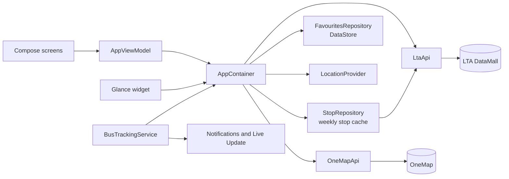

<div align="center">

# Tsugi (次, "next")

**A lightweight Singapore bus arrivals app for Android.**

*Native Kotlin and Material 3 Expressive, built on LTA DataMall for a phone you sideload it to.*

[](app/build.gradle.kts)
[](app/build.gradle.kts)
[](gradle/libs.versions.toml)
[](LICENSE)

[Features](#features) · [Architecture](#architecture) · [Quick start](#quick-start) · [Security](#security) · [Development](#development)

</div>

> **Tsugi shows the next bus, fast, and gets out of the way.**
>
> It reads LTA's live data directly. Journey planning, maps and its own arrival predictions are left to other apps.

> [!NOTE]
> **Pre-1.0 (`0.1.0`).** Built for personal sideloading, not the Play Store. It uses Material 3 Expressive alpha APIs (`1.5.0-alpha29`), so the UI layer may change with library updates.

## At a glance

| | |
| --- | --- |
| **Screens** | Favourites · Nearby · Search · Stop · Place |
| **Data** | LTA DataMall (bus arrivals, bus stops, train alerts) · OneMap (address search) |
| **Platforms** | Android 12+ (minSdk 31, target 37) · Live Updates on Android 16 QPR2+ |
| **Size** | About 3.6 MB release APK (R8 shrinking) |
| **Stack** | Kotlin 2.4 · Jetpack Compose · Material 3 Expressive · Glance · OkHttp · DataStore |

## Features

### Arrivals

- **Live times:** the next three buses for each service, refreshed every 20 s (LTA's update rate) only while the app is visible.
- **Bus details:** crowding as 1–3 bars, deck type, wheelchair access, and a dashed outline on timetable-based times.
- **MRT and LRT status:** line disruptions with affected stations and free bus or shuttle info. LTA doesn't publish live train times.

### Saving

- **Favourites:** a "Next up" card for your soonest bus, whole-stop cards and single-bus rows.
- **Places:** group stops, such as an interchange and the stops at the MRT exits, into one board sorted by soonest bus.
- **Save sheet:** one sheet to save a whole stop, pin individual buses, or add the stop to places.

### Finding stops

- **Nearby:** stops within 200, 400 or 800 m, using the platform location service rather than Play Services.
- **Search:** stop names, roads and codes, plus buildings, addresses and postal codes through OneMap.

### Alerts and widget

- **Bus alerts:** a live countdown notification for a bus you choose, with heads-up alerts at 2 minutes and on arrival. See [bus alerts](docs/bus-alerts.md).
- **Widget:** your next favourite buses on the home screen.

### Design

- **Wallpaper colour:** dynamic colour throughout, with fixed MRT line colours.
- **Expressive motion:** the countdown morphs when the bus arrives, times roll as they change, lists animate as they reorder, and the toolbar hides on scroll. Decorative motion stops when system animations are off.

## Architecture



A single module with hand-rolled dependency injection: `AppContainer` holds a few singletons, and one view model serves every screen. See [architecture](docs/architecture.md) for the refresh policy and navigation, and [data sources](docs/data-sources.md) for the endpoints used.

## Quick start

**Requirements:** JDK 17+, the Android SDK with platform 37.1, an LTA DataMall AccountKey, and a phone on Android 12+ with USB debugging on.

```sh
# 1. Clone the repository
git clone https://github.com/hoshinoht/tsugi.git && cd tsugi

# 2. Add your LTA key (or export LTA_ACCOUNT_KEY instead)
cp .env.example .env    # then set LTA_ACCOUNT_KEY=...

# 3. Point Gradle at the Android SDK (or set ANDROID_HOME)
echo "sdk.dir=<path-to-android-sdk>" >> local.properties

# 4. Build and install on the connected phone
./gradlew installRelease
```

**Next steps:**

| Step | Guide |
| --- | --- |
| Understand what's fetched and when | [Architecture](docs/architecture.md) |
| See which LTA and OneMap endpoints are used | [Data sources](docs/data-sources.md) |
| Set up bus alerts and Live Updates | [Bus alerts](docs/bus-alerts.md) |

## Security

> [!IMPORTANT]
> The LTA key is compiled into the APK through `BuildConfig`. That's fine for your own phone, but anyone with the APK can extract the key, so don't publish it.

- **Key sources:** an environment variable, `.env` or `local.properties`, checked in that order. Both files are git-ignored.
- **CI:** builds without a key, so CI artifacts never contain one.
- **Privacy:** no accounts or analytics. Your location stays on the device; LTA receives only stop codes, and OneMap only the search text.

## Development

```sh
./gradlew testDebugUnitTest               # unit tests
./gradlew lintDebug                       # Android lint
./gradlew assembleDebug assembleRelease   # debug and R8-shrunk release builds
./gradlew installRelease                  # install on a connected device
```

CI ([`.github/workflows/ci.yml`](.github/workflows/ci.yml)) runs the tests, lint and both builds on pushes to `master` and `dev` and on pull requests.

<details>
<summary>Repository layout</summary>

| Path | Contents |
| --- | --- |
| `app/src/main/java/dev/cantabile/tsugi/data/` | LTA and OneMap clients, models, stop cache, favourites, location |
| `app/src/main/java/dev/cantabile/tsugi/ui/` | Compose screens, shared components, theme |
| `app/src/main/java/dev/cantabile/tsugi/tracking/` | Bus alert foreground service and notifications |
| `app/src/main/java/dev/cantabile/tsugi/widget/` | Glance home-screen widget |
| `app/src/test/` | Unit tests for response parsing and helpers |
| `docs/` | Architecture, data sources and bus alerts |
| `gradle/libs.versions.toml` | Dependency versions |

</details>

## Non-goals

Tsugi is not a journey planner, a map, or an arrival predictor; it shows LTA's own times as they are. It doesn't target iOS or the Play Store, and it has no accounts or sync.

## License

[MIT](LICENSE). LTA DataMall and OneMap data are subject to their own terms of use.
